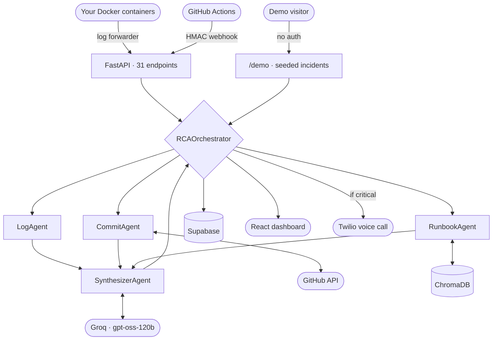

<div align="center">

# OpsTron

**Links a production error to the commit that caused it, and says what to do about it.**

[](https://www.python.org/downloads/)
[](https://fastapi.tiangolo.com/)
[](https://react.dev/)
[](#testing)
[](https://opensource.org/licenses/MIT)

### [▶ Try the live demo](https://hitanshuthegr8.github.io/OpsTron/demo)

No account, no setup. Runs a real analysis in about ten seconds.

</div>

---

## What it is

When a deploy breaks production, the slow part isn't noticing — it's working out *which change* did it. OpsTron reads the error logs, pulls the recent commits, searches your runbooks, and produces a root cause report naming the likely commit, with remediation steps.

It runs four agents over each incident:

| Agent | Does |
|---|---|
| `LogAgent` | extracts error signals from raw log text |
| `CommitAgent` | fetches recent commits from the GitHub repo |
| `RunbookAgent` | vector-searches the runbook corpus (ChromaDB) for matching procedures |
| `SynthesizerAgent` | combines all three into a structured RCA via an LLM |

Inference is [Groq](https://console.groq.com)-hosted **`openai/gpt-oss-120b`**, configurable via `GROQ_MODEL`.

## Demo

**[hitanshuthegr8.github.io/OpsTron/demo](https://hitanshuthegr8.github.io/OpsTron/demo)**

The demo walks through one incident: a deploy caps a database connection pool at 10, the pool saturates under normal traffic, checkout starts returning 500s, and OpsTron traces it back to the commit.

**What's simulated and what isn't.** The incident is a fixture — the logs, the commit history and the deployment metadata describe a service that doesn't exist. Everything downstream is the real system: the same orchestrator that serves authenticated users does the signal extraction, the runbook retrieval and the synthesis, live, when you press the button. The page states this split on screen. If the pipeline is down the demo returns an error rather than a stored report.

Reproduce it locally after setup:

```bash
curl -X POST http://localhost:8001/demo/scenarios/pool-exhaustion/analyze
```

## Architecture



**Layout**

```
agent/                     FastAPI backend
  app/api/routes/          endpoint modules (health, auth, ingest, analyze, demo, …)
  app/core/agents/         the four RCA agents
  app/core/orchestrator.py the pipeline that runs them
  app/demo/scenarios.py    seeded incident fixtures
  app/db/                  Supabase client + ChromaDB vector store + schema.sql
  tests/                   pytest suite
lov_frontend/opstronic-delight/   React + TanStack Start frontend
runbooks/                  markdown runbooks indexed into ChromaDB at startup
```

**Deployed as:** frontend on GitHub Pages (built by `.github/workflows/deploy-frontend.yml`), backend on Render at `https://opstron.onrender.com`.

## Local setup

Setup takes roughly **10 minutes**, most of it `pip install` — the dependency tree includes ChromaDB and onnxruntime. It is not a 60-second install.

### Prerequisites

- **Python 3.12** (3.13 also resolves; 3.11 and below are untested)
- **Node.js 20+** and npm
- A **Groq API key** — free at [console.groq.com](https://console.groq.com/keys)

Everything else is optional and only needed for specific features (see [Environment variables](#environment-variables)).

### 1. Clone

```bash
git clone https://github.com/hitanshuthegr8/OpsTron.git
cd OpsTron
```

### 2. Backend

```bash
cd agent
python -m venv .venv
```

Activate it — **Windows (PowerShell)**:
```powershell
.venv\Scripts\Activate.ps1
```
**macOS / Linux**:
```bash
source .venv/bin/activate
```

Then:
```bash
pip install -r requirements.txt
```

### 3. Configure

The backend reads `agent/.env` — **not** the repo root, and not `app/core/config/`. Copy the template up two levels:

```bash
cp app/core/config/.env.example .env
```

Minimum to boot and run an analysis — just one line:

```env
GROQ_API_KEY=gsk_your_key_here
```

`GROQ_MODEL` defaults to `openai/gpt-oss-120b`; set it only if your account has a different catalogue (see [Troubleshooting](#troubleshooting)).

### 4. Run the backend

```bash
python -m uvicorn main:app --host 127.0.0.1 --port 8001
```

Verify:
```bash
curl http://localhost:8001/health
```

Interactive API docs: <http://localhost:8001/docs>

> Use `uvicorn` rather than `python main.py`. The latter enables `reload=True` on port 8001, which is awkward when running in the background.

### 5. Frontend

In a second terminal:

```bash
cd lov_frontend/opstronic-delight
npm install
echo "VITE_BACKEND_URL=http://localhost:8001" > .env
npm run dev
```

Open **<http://localhost:8080/demo>**. Without `.env`, the frontend points at the deployed backend instead of yours.

### 6. Confirm it works

```bash
curl -X POST http://localhost:8001/demo/scenarios/pool-exhaustion/analyze
```

A working install returns a JSON report whose `root_cause` names commit `a7f3c21`. If it returns `"analysis_failed"`, see [Troubleshooting](#troubleshooting).

## Environment variables

All live in `agent/.env`. Only the first is required.

| Variable | Required | Purpose |
|---|---|---|
| `GROQ_API_KEY` | **yes** | LLM inference |
| `GROQ_MODEL` | no | defaults to `openai/gpt-oss-120b` |
| `GITHUB_CLIENT_ID` / `GITHUB_CLIENT_SECRET` | for login | GitHub OAuth app credentials |
| `FRONTEND_URL` | for login | where the OAuth callback redirects back to |
| `SUPABASE_URL` / `SUPABASE_SERVICE_KEY` | for persistence | without these the app runs stateless |
| `GITHUB_TOKEN` | no | raises the GitHub API rate limit; public repos work without it |
| `WEBHOOK_SECRET` | for CI/CD | HMAC secret shared with GitHub Actions |
| `SERVICE_API_KEY` | for the agent | authenticates the log forwarder |
| `TWILIO_*`, `ALERT_PHONE_NUMBER` | for voice alerts | Twilio credentials |
| `CORS_ALLOWED_ORIGINS` | for deployment | comma-separated; `FRONTEND_URL` is always trusted too |
| `ENVIRONMENT` | no | `production` enforces required secrets and disables the dev CORS regex |
| `DEMO_RATE_LIMIT_PER_MINUTE` | no | default 4, per client IP |

> `GEMINI_API_KEY` appears in older docs. It is **not used** — only Groq is wired up.

### Database (optional)

Login and incident history need Supabase. Create a project, then run [`agent/app/db/schema.sql`](agent/app/db/schema.sql) in the SQL Editor — it is idempotent and safe to re-run. Put the project URL and the **secret** key (not the publishable one) in `agent/.env`, then verify:

```bash
python verify_supabase.py
```

### GitHub OAuth (optional)

Create an OAuth app at <https://github.com/settings/developers>:

- **Homepage URL** — your frontend, e.g. `http://localhost:8080`
- **Authorization callback URL** — your **backend**, e.g. `http://localhost:8001/auth/github/callback`

The callback must point at the backend, not the frontend. See [Troubleshooting](#troubleshooting).

### Docker log forwarder (optional)

Streams container logs into the backend:

```bash
export OPSTRONIC_URL="http://localhost:8001"
export CONTAINER_NAME="my-service"
python agent/opstronic_forwarder.py
```

It regex-filters locally so only error lines cross the network, and needs no access to your Docker daemon from the server.

## Testing

```bash
cd agent
pytest
```

26 deterministic tests, no network calls. Covers the demo fixtures and boundary, the rate limiter, CORS resolution, production startup validation, and the authentication boundary.

Integration tests make a **real, billed** Groq call and are opt-in:

```bash
pytest -m integration
```

`agent/scripts/manual/` holds debugging scripts. They are not tests and have no assertions.

## Troubleshooting

Real problems hit while building this, with the fix.

**`analysis_failed` with `model ... does not exist`**
Groq rotates its catalogue and access varies by tier. List what your key actually has and set `GROQ_MODEL` to one of them:
```bash
curl -H "Authorization: Bearer $GROQ_API_KEY" https://api.groq.com/openai/v1/models
```

**`chroma-hnswlib` fails to build during `pip install`**
You're on an old pin. `chromadb` must stay `>=1.0`; `0.4.x` needs `chroma-hnswlib`, which ships no wheel for Python 3.12 on Windows and requires MSVC to compile.

**`ResolutionImpossible` mentioning `fastapi`**
`chromadb 1.0.x` hard-pins `fastapi==0.115.9`. An exact `fastapi==` pin elsewhere makes the resolve unsatisfiable. `requirements.txt` uses ranges for exactly this reason — don't re-pin them.

**Settings look ignored / `.env` not read**
It must be `agent/.env`. `app/core/config/.env.example` is only a template.

**Supabase `Invalid API key` before any network call**
`supabase-py` below 2.31 validates the key against a JWT regex and rejects current `sb_secret_...` keys outright. `requirements.txt` requires `>=2.31`, which accepts both formats.

**Every browser API call blocked by CORS**
Vite doesn't guarantee a port — if 8080 is taken it moves to 8081 and the origin no longer matches. Outside production any localhost port is allowed by regex. In production add the origin to `CORS_ALLOWED_ORIGINS`.

**`The code passed is incorrect or expired` on login**
Usually the OAuth app's callback URL points at the wrong host. Codes are issued per `client_id`; if the callback delivers to a *different* server, its credentials won't match and GitHub rejects the code. Note the distinction: a wrong secret gives `incorrect_client_credentials`, a wrong callback host gives `bad_verification_code`. Codes are also single-use — refreshing the error page always reproduces it.

**`UnicodeEncodeError` in logs on Windows**
Fixed. `main.py` forces stdout to UTF-8 because cp1252 consoles can't print the non-ASCII characters in log messages.

## API reference

| Method | Endpoint | Auth |
|---|---|---|
| `GET` | `/health` | none |
| `GET` | `/demo/scenarios` | none |
| `GET` | `/demo/scenarios/{id}` | none |
| `POST` | `/demo/scenarios/{id}/analyze` | none, rate limited |
| `POST` | `/analyze` | none — manual log upload |
| `GET` | `/auth/github/login` | none — starts OAuth |
| `GET` | `/rca-history` | session |
| `POST` | `/ingest-error` | service API key |
| `POST` | `/notify-deployment` | HMAC-SHA256 |

Full generated docs at `/docs` when running.

## Documentation

- [Architecture](docs/ARCHITECTURE.md)
- [Engineering learning log](docs/ENGINEERING_LEARNING_LOG.md) — problems hit, and what each one teaches
- [Concept map](docs/OPS_TRON_CONCEPT_MAP.md) — what to understand to work on this
- [Lessons](LEARNINGS.md)

---

<div align="center">
MIT licensed.
</div>
