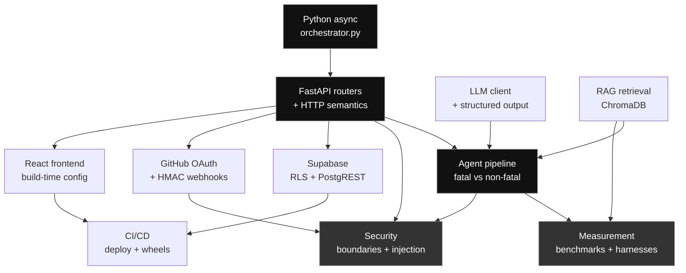

# OpsTron Concept Map

The concepts you actually need to understand *this* codebase — each tied to where it appears and why OpsTron needs it. Deliberately not a technology list: "learn Docker" is useless, "understand why the log forwarder pushes instead of the server pulling" is not.

Mastery: **Understand** (explain it) · **Read** (follow the code) · **Modify** (change it safely) · **Implement** (build it fresh) · **Architect** (design the approach)

---

## Programming (Python)

**`async`/`await` and the event loop** — `Modify`
The four agents are `async` and the orchestrator awaits them in sequence. Understanding this tells you why steps 1–3 could run concurrently but currently don't, and what would change if they did.
→ `agent/app/core/orchestrator.py::analyze`

**Async context managers** — `Read`
`async with httpx.AsyncClient() as client` — knowing when the connection closes explains why a timeout there is a correctness problem, not just a slow request.
→ `agent/app/api/routes/auth.py`

**Exception handling as a design decision** — `Implement`
The orchestrator treats a `CommitAgent` failure as non-fatal (empty commits) but a `SynthesizerAgent` failure as fatal. Know *why* each choice is right.
→ `agent/app/core/orchestrator.py` — the three `try/except` blocks

**Type hints and `Optional`** — `Modify`
`commit_analysis_override: Optional[Dict]` — `None` means "fetch from GitHub", a dict means "use this". The type encodes the behaviour.

*Skip:* metaclasses, descriptors, `__slots__`. Not used here.

---

## Backend (FastAPI)

**Routers and prefixes** — `Implement`
Endpoints are grouped per feature and composed into one `api_router`. Adding `/demo` meant adding a module, not touching `main.py`.
→ `agent/app/api/__init__.py`, `agent/app/api/routes/demo.py`

**Dependency injection vs manual checks** — `Understand`
Auth here is enforced by explicit calls rather than FastAPI `Depends`. Know the trade-off — and that the demo router deliberately has neither.

**Middleware ordering** — `Read`
`CORSMiddleware` runs before route handlers, which is exactly why a blocked preflight never appears in application logs.
→ `agent/main.py::create_app`

**Lifespan events** — `Understand`
Runbooks are indexed into ChromaDB on startup because the deploy filesystem is ephemeral — indexing at build time would not survive a restart.
→ `agent/main.py::lifespan`, `_index_runbooks`

**Pydantic Settings** — `Implement`
Environment loading, defaults, and `extra="ignore"`. Two subtle behaviours matter: env vars beat `.env`, and `_resolve_env_file()` searches two locations.
→ `agent/app/core/config/settings.py`

*Skip:* WebSockets, background tasks, GraphQL. Not used.

---

## Frontend (React + TanStack Start)

**File-based routing** — `Modify`
`src/routes/demo.tsx` becomes `/demo`; `routeTree.gen.ts` is generated — never hand-edit it.

**`basepath` vs `base`** — `Understand`
GitHub Pages serves from `/OpsTron/`, so the router basepath and Vite's asset base must both be set or every asset 404s.
→ `lov_frontend/opstronic-delight/vite.config.ts`

**Build-time environment injection** — `Implement`
`import.meta.env.VITE_BACKEND_URL` is substituted at **build** time and baked into the bundle. This is why changing a backend URL requires a rebuild, and how the wrong backend got shipped (learning log 14).
→ `src/lib/api.ts`

**`useEffect` for data fetching, and cleanup** — `Modify`
The demo page fetches the incident on mount and runs an interval while analysing. The cleanup return prevents a leaked timer.
→ `src/routes/demo.tsx`

**Prerendering / SSR** — `Understand`
Routes are prerendered at build time, which is why `typeof window === "undefined"` guards exist. Code that assumes a browser breaks the build, not the page.

*Skip:* Redux, React Server Components, Suspense data fetching. Not used.

---

## APIs and HTTP

**CORS, preflight, and credentials** — `Implement`
Which requests trigger `OPTIONS`, why the failure is browser-side only, and why `allow_credentials` interacts with wildcard origins.
→ `agent/app/core/config/settings.py::cors_origins`, `cors_origin_regex`

**Idempotency and retry safety** — `Architect`
An OAuth code exchange is not idempotent. Retrying it is actively harmful. Classify every outbound call this way.
→ `agent/app/api/routes/auth.py`

**Timeouts** — `Implement`
`httpx` defaults to 5s. Know what happens when a timeout fires *after* the remote side acted.

**Status codes as diagnostics** — `Understand`
The demo returns 404 for an unknown scenario, 429 when rate limited, 503 when the pipeline is down. Each is a different instruction to the client.
→ `agent/app/api/routes/demo.py`

---

## Databases

**Postgres DDL idempotency** — `Implement`
`CREATE TABLE IF NOT EXISTS` exists; `CREATE POLICY IF NOT EXISTS` does not. This asymmetry broke setup.
→ `agent/app/db/schema.sql`

**Row Level Security, and why the backend bypasses it** — `Architect`
The service key ignores RLS; the publishable key respects it. Understand why the backend needs the former and the browser must never see it.
→ `schema.sql` (the `GRANT ... TO service_role` lines)

**PostgREST semantics** — `Read`
Supabase queries are HTTP. `.single()` returns **406** for zero rows — which is a normal "not found", not an error.
→ `agent/app/db/supabase_client.py`

**Vector search / embeddings** — `Understand`
ChromaDB embeds runbooks and retrieves by cosine similarity, which is why "502 bad gateway" can match a timeout runbook. This is the R in RAG.
→ `agent/app/db/chroma_store/vector_store.py`

*Skip:* SQL query optimisation, sharding, connection pooling internals — ironic given the demo scenario, but OpsTron doesn't manage its own pool.

---

## GitHub

**OAuth 2.0 authorization code flow** — `Implement`
All four legs, and which party holds which secret. The callback URL belongs to the *app registration*, not the client that starts the flow — the single highest-value thing to understand here.
→ `agent/app/api/routes/auth.py`

**GitHub error taxonomy** — `Understand`
`incorrect_client_credentials` vs `bad_verification_code` distinguishes a wrong secret from a wrong callback host. This is a debugging superpower.

**HMAC webhook verification** — `Implement`
Why a shared secret plus a signature header proves origin, and why comparison must be constant-time.
→ `agent/app/api/middleware/auth.py`

**API rate limits** — `Read`
Unauthenticated GitHub API calls are limited to 60/hour, which is why `GITHUB_TOKEN` exists as an optional setting.

---

## Docker

**Push vs pull log collection** — `Architect`
The forwarder runs *beside* your containers and pushes filtered logs out. The alternative — exposing the Docker socket to the server — would be a remote-code-execution risk. Understand why the push model was chosen.
→ `agent/opstronic_forwarder.py`, `agent/Dockerfile.agent`

**Edge filtering** — `Understand`
The forwarder regex-filters locally so only error lines cross the network. This is a bandwidth *and* privacy decision.

*Skip:* Kubernetes, multi-stage build optimisation, Compose networking. Not used by this deployment.

---

## CI/CD and deployment

**GitHub Actions triggers and path filters** — `Modify`
The frontend deploys only when frontend paths change.
→ `.github/workflows/deploy-frontend.yml`

**Secrets vs literals in workflows** — `Understand`
`${{ secrets.X || 'literal' }}` — a missing secret silently shipping an empty base URL is what broke the deployed login.

**Build-time vs runtime configuration** — `Architect`
The frontend bakes config at build time; the backend reads it at runtime. This asymmetry explains why a frontend change needs a redeploy and a backend one needs only a restart.

**Platform-specific dependency resolution** — `Implement`
The same `requirements.txt` resolves differently on Windows and Linux. Simulate the target with `pip install --dry-run --platform`.

**Ephemeral filesystems** — `Understand`
Render's disk does not survive restarts, which dictates startup-time runbook indexing.

---

## Observability

**Structured logging and levels** — `Modify`
The orchestrator logs each step, which is what makes a failed pipeline diagnosable from Render's log view.

**Log encoding at the boundary** — `Understand`
See learning log 11.

**What is *not* here** — `Understand`
No tracing, no metrics, no health-check depth beyond liveness. Know the gap: `/health` returns healthy even when Supabase is down.

---

## Security

**Structural vs defensive boundaries** — `Architect`
The demo accepts an enum key, not text. Contrast with `/analyze`, which accepts arbitrary uploads. The most important security idea in this codebase.
→ `agent/app/api/routes/demo.py`

**Prompt injection** — `Architect`
Any untrusted text reaching an LLM prompt is an injection surface. This is why `/analyze` is not the public demo.

**Rate limiting** — `Implement`
Sliding window, per-key buckets, and the honest limitation that in-memory limits are per-process.
→ `agent/app/utils/rate_limit.py`

**Credential shape and handling** — `Understand`
JWT vs opaque tokens; why service keys never reach the browser; why `.gitignore` globs need verifying.

**Least privilege** — `Understand`
The OAuth app requests `repo` scope. Ask whether it needs to.

---

## LLMs

**Prompt structure and JSON output** — `Implement`
The synthesizer asks for JSON and strips code fences defensively, because models return fenced JSON unpredictably.
→ `agent/app/core/llm.py::invoke_structured`

**Model identifiers and provider catalogues** — `Understand`
Providers rotate models and access varies by tier — which is why the model is configuration, not a literal.
→ `settings.GROQ_MODEL`

**Non-determinism** — `Architect`
The same input yields different wording each run. This shapes what you can assert in tests (structure, not text) and why the demo is honest about being live.

**Temperature and token limits** — `Read`
`temperature=0` for reproducibility, `max_tokens=4000` as a cost ceiling.

*Skip:* fine-tuning, embeddings training, quantisation. Not used.

---

## Agent architecture

**Orchestration vs autonomy** — `Architect`
OpsTron's "agents" are a fixed pipeline, not autonomous planners. Be able to say this precisely in an interview — claiming autonomy you don't have is the fastest way to lose credibility.
→ `agent/app/core/orchestrator.py`

**Separation of concerns across agents** — `Implement`
Each agent has one input type and one output shape. This is why seeding commit data required no change to the other three.

**Graceful degradation** — `Architect`
Missing commits produce a weaker RCA, not a failure. Missing synthesis is fatal. Know why the split falls there.

---

## RAG

**Retrieval before generation** — `Implement`
Error signals become a query; matched runbooks become prompt context. Understand what changes when retrieval returns nothing.
→ `agent/app/core/agents/runbook_agent.py`

**Chunking and corpus design** — `Understand`
Runbooks are small whole documents, so no chunking is needed. Know at what size that stops being true.

**Retrieval quality measurement** — `Implement`
Precision@1 was measured at 92% (11/12) with hand-labelled queries. Be able to explain the metric and the one miss.
→ `LEARNINGS.md` §16

---

## Incident response (domain)

**Root cause vs contributing factors** — `Understand`
The report separates them. Know the difference — it is a real discipline, not LLM formatting.

**MTTR and why commit correlation matters** — `Understand`
The product thesis: identifying *which change* broke production is the slow step.

**Alert fatigue, dedup, and cooldowns** — `Architect`
The 60s dedup window and per-service cooldown exist because 242 raw events becoming 242 pages is worse than useless.

**Severity thresholds** — `Understand`
Why a voice call needs a higher bar than a dashboard entry.

---

## Testing

**Unit vs integration separation** — `Implement`
Tests touching Groq are marked and deselected by default, because a default suite must not make billed, non-deterministic calls.
→ `agent/pytest.ini`

**Testing a security boundary** — `Architect`
`test_unknown_scenario_analysis_is_refused_before_the_pipeline_runs` asserts a 404 *specifically* because 500 or a slow 200 would prove the boundary leaked.

**Fixtures** — `Modify`
→ `agent/tests/conftest.py`

**What to assert against non-deterministic output** — `Architect`
Assert structure and constraints (`confidence in {low, medium, high}`), never exact text.

---

## System architecture

**Why the pipeline is sequential** — `Architect`
Steps 1–3 are independent and could run concurrently. They don't. Decide whether that is a bug, and what it would cost to change.

**Stateless degradation** — `Understand`
No Supabase means no persistence but a working analysis. This is what makes one-env-var setup possible.

**Trust boundaries** — `Architect`
Map them: browser → backend, backend → GitHub/Groq/Supabase, forwarder → backend. Each has a different auth mechanism, and knowing which is which is the difference between understanding this system and reciting it.

---

---

## Design and accessibility

Added after the monochrome rewrite, which removed the channel most of the UI was relying on.

**Redundant encoding** — `Implement`
Meaning must not be carried by hue alone. The confidence badge encodes level three ways at once: fill, border weight and a dot count. This is simultaneously an accessibility requirement and what makes a monochrome theme possible.
→ `src/routes/demo.tsx::ConfidenceBadge`

**Visual hierarchy without colour** — `Understand`
Lightness steps, border weight, spacing and position do the work a palette normally does. The theme is four elevation steps deliberately close together, so contrast is available for content rather than spent on chrome.
→ `src/styles.css` — the four surface tokens

**CSS cascade resolution** — `Modify`
`:root` and `.dark` both match `<html>` with the same specificity, so source order decides. Know this before editing a design token, or the edit appears to do nothing.
→ `src/styles.css`, `src/routes/__root.tsx`

**OKLCH colour** — `Understand`
`oklch(L C H)` — lightness, chroma, hue. Setting chroma to zero gives a perceptually even greyscale ramp, which is why the monochrome conversion was a mechanical edit rather than a redesign.

*Skip:* colour theory beyond this, design systems theory, animation libraries. Not used.

---

## Instrumentation

**Measuring vs simulating** — `Architect`
The orchestrator computed every agent's output and discarded it. Surfacing real measurements through an optional callback cost almost nothing; animating a guess cost credibility. Before building any progress indicator, ask what the system can actually report.
→ `agent/app/core/orchestrator.py::analyze` (`_emit`), `src/components/demo-parts.tsx::StepRow`

**Callback hooks as an extension point** — `Implement`
`on_step` is optional and defaults to `None`, so production paths are unchanged and pay nothing. Compare with the alternative of a second code path for the demo, which would have drifted.

**Streaming responses** — `Understand`
Prototyped and deferred. Worth knowing why: a `StreamingResponse` commits `200 OK` on the first byte, so a mid-stream failure cannot be an HTTP status and must travel as an event the client looks for. Also that proxies buffer by default, which silently turns streaming back into a single delivery.

**What each verification catches** — `Modify`
`compileall` catches syntax. Importing catches names. Running catches behaviour. Tests catch regressions. Choosing too weak a check is how a `NameError` reached startup.

---

---

## Measurement and benchmarking

Added after two recorded metrics failed to reproduce. This is now the section that matters most for interviews, because it is the one most projects skip.

**A metric is a claim until it has a harness** — `Architect`
`92% precision@1` and `22:1 suppression` lived in `LEARNINGS.md` for weeks with nothing to re-run them. Building the harnesses moved both numbers. Any figure you would put on a CV ships with the command that regenerates it.
→ `agent/benchmarks/`

**Precision@k, and why the query set is half the number** — `Implement`
`8/12` and `92%` are not disagreeing measurements — they are different measurements. A precision figure without its labelled set is meaningless. State the corpus size too: 3 runbooks means a ~33% random-guess floor.
→ `agent/benchmarks/runbook_queries.json`

**Reading failure patterns, not just failure counts** — `Architect`
All four retrieval misses returned the same runbook. That is the actual finding: one document is broader than the others and dominates similarity for anything latency-shaped. Corpus imbalance, invisible if you only look at the score.

**Deterministic testing of time-dependent logic** — `Implement`
A suppression ratio measured against wall-clock timing drifts with machine load. Injecting a fake clock makes the same input produce the same answer every run — and takes milliseconds instead of minutes.
→ `agent/benchmarks/run_dedup_load_test.py`, `tests/test_dedup_and_retrieval.py`

**Sliding vs fixed windows** — `Implement`
`is_duplicate()` stamped its timestamp on every call including duplicates, turning a 60s fixed window into a sliding one that never expired. One event admitted ever, and the cooldown layer beneath it unreachable. Know which semantics you are implementing.
→ `agent/app/core/dedup.py::is_duplicate`

**Layered suppression: protecting compute vs protecting humans** — `Architect`
Dedup asks "is this new information?" and guards the LLM budget. Cooldown asks "does a person need telling again?" and guards the on-call. Different keys, different windows, different jobs — which is why one cannot replace the other.
→ `agent/app/core/dedup.py`

*Skip:* statistical significance testing, A/B frameworks, MLflow. The measurements here are small and deterministic; they do not need that machinery.

---

## The map

How the areas depend on each other. Follow an arrow only after the box behind it makes sense.

**Start at `PY → API → AGENT`.** That path is the spine — everything else attaches to it. `MEAS` and `SEC` are the two that produce interview answers, so reach them early rather than saving them for last.

---

## Suggested order

1. **Backend + APIs** — the orchestrator and routers are the spine.
2. **LLMs + Agent architecture + RAG** — what makes it more than CRUD.
3. **Security** — the demo boundary is the sharpest idea here.
4. **Databases** — RLS and PostgREST semantics.
5. **GitHub OAuth** — highest debugging value per hour.
6. **Frontend** — build-time config is the part that actually bites.
7. **CI/CD + deployment** — platform-specific resolution, ephemeral disks.
8. **Testing + Observability** — what to assert, and what isn't measured.
9. **Measurement + benchmarking** — harnesses, failure patterns, deterministic time.
10. **Instrumentation** — measuring versus simulating; what each verification step actually catches.
11. **Design + accessibility** — redundant encoding and the CSS cascade; short, and it pays for itself the first time a token edit appears to do nothing.

> **Do measurement early, not last.** It sits at position 9 by dependency, but it is where your strongest interview answers come from — every number on your CV traces back to it.
